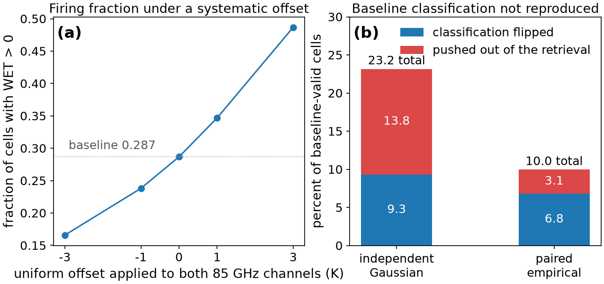
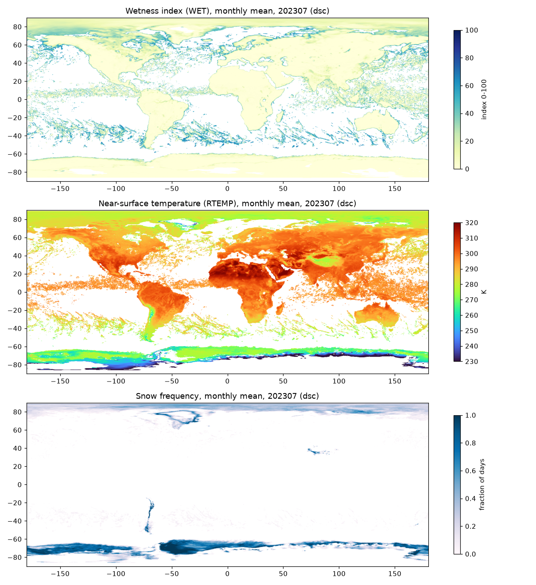
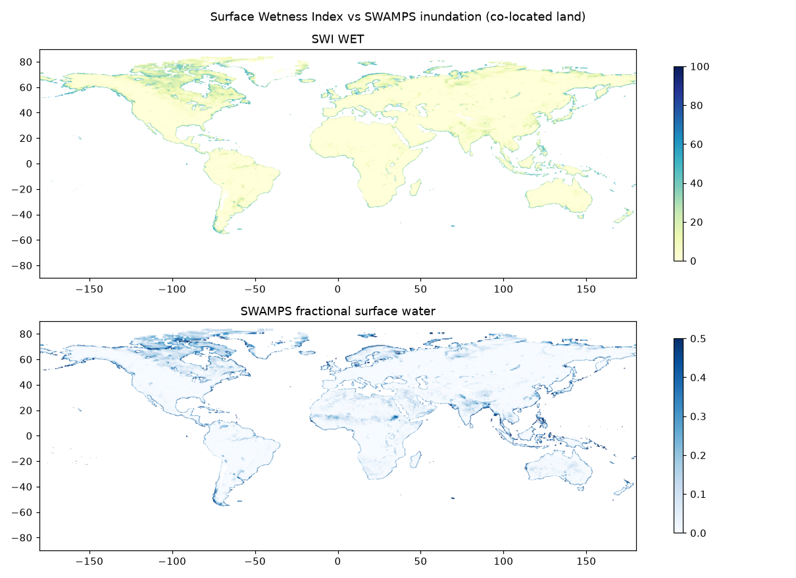
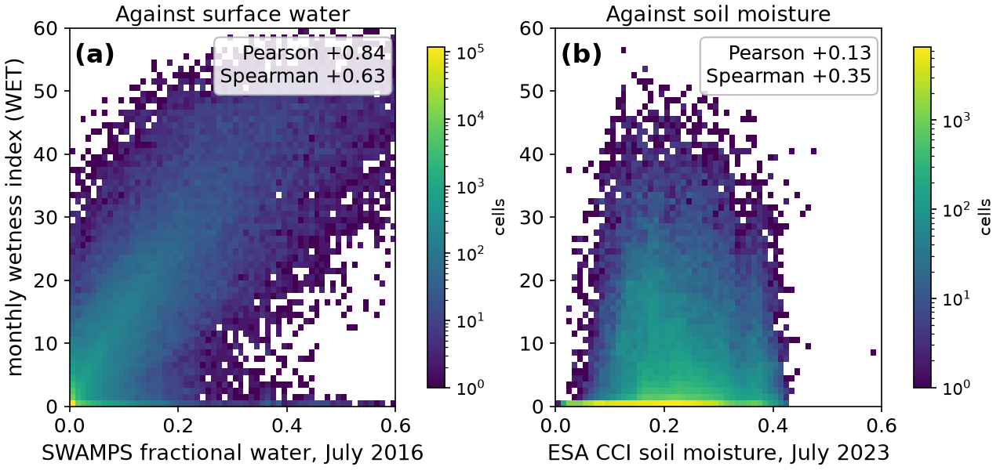
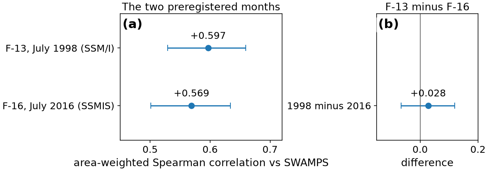
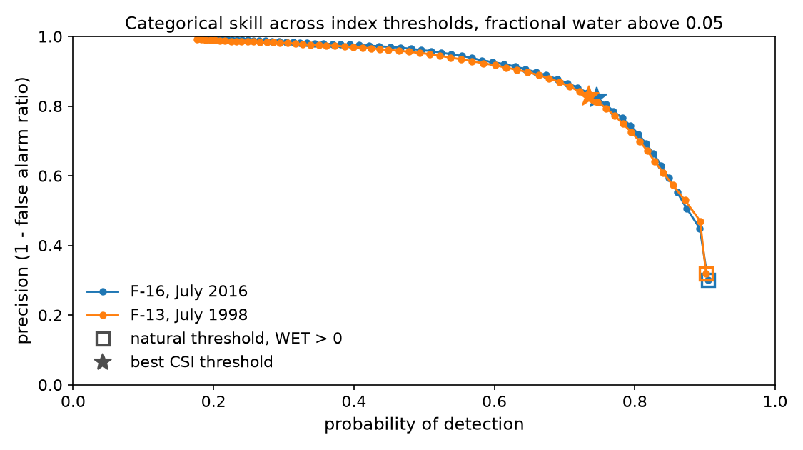
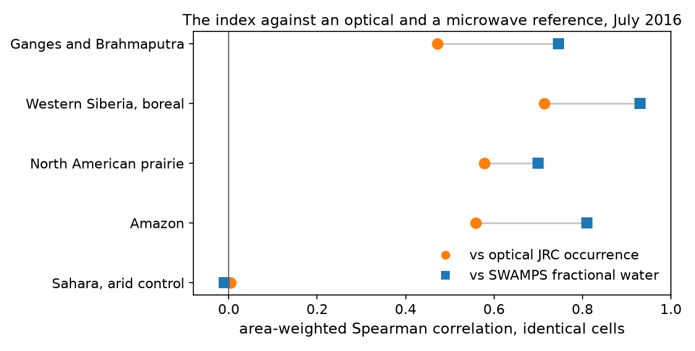
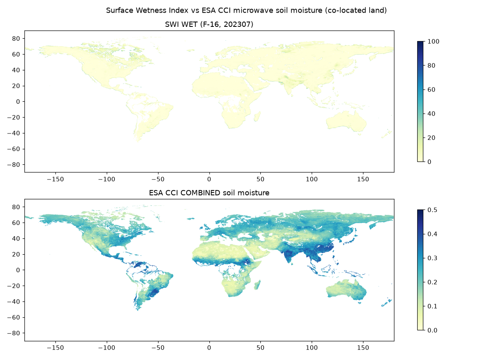
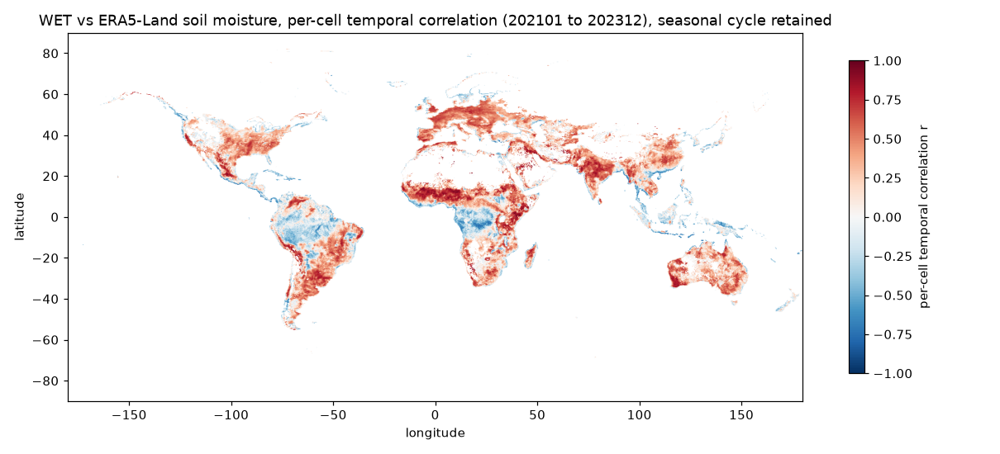
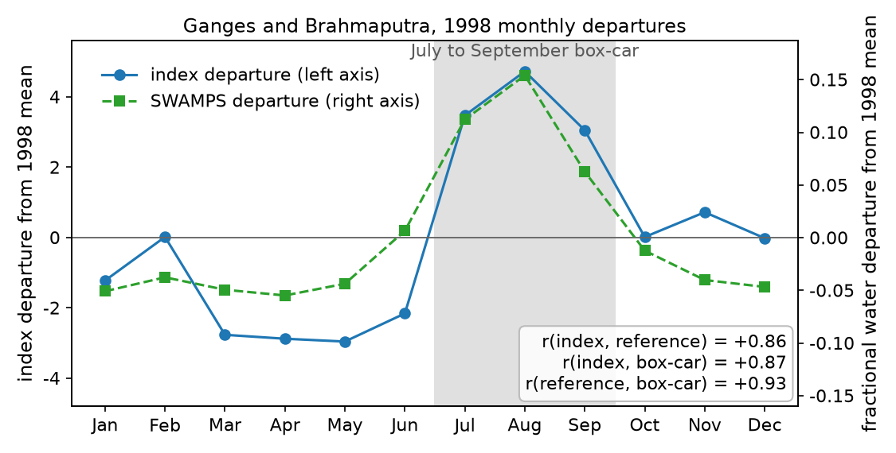

# A plain-language guide to the Surface Wetness Index reconstruction

This document explains the project in plain terms, with the paper's figures and
the numbers behind them. The technical account is the journal manuscript, in
preparation for the Journal of Geophysical Research. Everything here is stated
more simply, but nothing is stated more confidently than the paper states it. Figure numbers match the
manuscript's, so the two documents cross-reference, which is why they appear
out of numeric order in places.

## What the index is

In the late 1990s, scientists at the National Oceanic and Atmospheric
Administration (NOAA) National Climatic Data Center (NCDC,
now part of the National Centers for Environmental Information, NCEI) built a tool that estimates how wet the land surface is from space, using
microwaves. Alan Basist and colleagues called it the Surface Wetness
Index. It reads the seven channels of a satellite microwave radiometer, the
Special Sensor Microwave/Imager (SSM/I), and turns them into three numbers for
each spot on a map. A wetness index from 0 to about 100. A temperature. A
snow-and-ice flag.

Microwaves pass through clouds, so the index could see standing water and
saturated ground in places and seasons where optical satellites see only cloud
tops. Through the early 2000s it appeared in the American Meteorological
Society's annual State of the Climate reports and supported agricultural and
flood monitoring. Then its authors moved on, and the product stopped. The
algorithm survived only as a 2004 snapshot of its source code and a set of
internal documents.

## Why bring it back

Two things changed since the product went dormant. The satellite record it
reads grew to nearly four decades, and the input it needs became far better.
Colorado State University (CSU) now maintains a carefully intercalibrated
brightness-temperature record from the whole SSM/I family and its successor,
the Special Sensor Microwave Imager/Sounder (SSMIS), spanning 1987 to the
present, distributed openly by NOAA NCEI. An algorithm with a proven use, a
recovered source, and a modern intercalibrated input to feed it is a rare
combination. The project's goal is to bring the index back on that input,
document it properly, and state plainly what it can and cannot do.

## Recovering the engine

Reconstruction started with proof rather than trust. The 2004 C source, a
decision tree of 42 tests, still compiles, and it became the reference against
which everything else is checked. A modern Python version was written alongside
it, and the two are compared cell for cell on the same inputs. Across 15
million tested cells the two implementations disagree exactly zero times. Of
the tree's 42 conditions, 38 can be reached by real data, all 38 are exercised
by the test suite, and the remaining 4 are provably unreachable in the
recovered source. They are reported as found rather than repaired, because the
goal is an exact realization of the recovered algorithm, not an improved one.

No input-output pair from the original operational era survives, so there is no way to confirm that the
recovered source is byte-for-byte the code that produced the products
distributed in the early 2000s. The reconstruction is exact to the source that
survives.

## The modern input, and one adjustment it needs

The index was designed for SSM/I, whose high-frequency channels sit at 85 GHz.
The follow-on SSMIS instrument moved those channels to 91 GHz. Feeding 91 GHz
data to a tree tuned for 85 GHz requires a small spectral adjustment, and the
project fits one empirically from the period when an SSM/I and an SSMIS flew at
the same time, using the F-15 and F-16 satellites in 2006, matched in time so
that day-night differences do not contaminate the fit.

How much this adjustment matters was measured rather than assumed. Figure 1
shows the sensitivity. Small uniform errors in the adjustment shift how much of
the world the index calls wet, and errors at the scale of the fit's own
residuals change the wet-or-dry classification of 10 to 23 percent of cells,
depending on the error model. This is the reconstruction's soft spot, and the
paper says so plainly. On SSM/I itself, which measures 85 GHz directly, no
adjustment is needed at all, which is one reason the strongest test of the
index (section below) was run on SSM/I.

Figure 1, in plain terms. Panel (a) shows how the fraction of land the index
calls wet moves as a deliberate error is added to the 85 GHz channels. Panel
(b) shows how often a cell's wet-or-dry answer flips when the adjustment is
wrong by about as much as the fit's own scatter.

## What the product looks like

Figure 2 is one month of the reconstructed product from SSMIS, July 2023. Wet
appears where the world is wet. The Amazon, the Congo basin, the monsoon belt
of South Asia, the boreal wetlands of Siberia and Canada. Deserts read dry. The
snow flag takes over at high latitudes in winter. A map that looks right is not
evidence of much on its own, and the rest of the work is about replacing that
impression with measurements.

## How well it finds surface water

The natural first question for a wetness index is whether high values sit where
water actually is. The reference used for that is SWAMPS, the Surface Water
Microwave Product Series, which estimates the fraction of each cell covered by
surface water. Co-locating one month of the index with SWAMPS over land gives
235,235 comparable cells.

Three numbers summarize Figure 3. The rank correlation between the index and
fractional surface water is +0.57 when each cell is weighted by its true area
(+0.63 unweighted). Cells that SWAMPS calls inundated carry index values about
4.2 times higher than cells it calls dry, and the 95 percent confidence
interval on that ratio, 3.45 to 5.30, sits far from 1.0, the value that would
mean no difference. And when SWAMPS says a cell is clearly inundated, the index flags
it 95 percent of the time.

The same comparison also shows the index's main weakness at its natural
setting. It fires on about two thirds of scored cells, far more than are
actually inundated, so roughly 70 percent of its raised flags land on cells the
reference does not call inundated. The index as originally tuned is a sensitive
detector with a high false alarm ratio, and what that trade is worth depends on
the threshold chosen, which a later section quantifies.

Figure 5 shows the joint distributions behind these summaries, index against
surface water and index against soil moisture, so the shape of the relationship
is visible rather than compressed into single numbers.

## The test that was designed before its answer was known

A comparison chosen after looking at the data can flatter any method. The
strongest evidence in the project therefore comes from a preregistered test,
meaning the months, the references, the statistics and the thresholds were
fixed and committed in writing before the reference data was ever downloaded.

The test asks whether the SSMIS result transfers backward to SSM/I, across
sensors, across satellites, and across 18 years, with no spectral adjustment in
the path because SSM/I measures 85 GHz natively. July 2016 on F-16 SSMIS is
compared with July 1998 on F-13 SSM/I, each against its own month of SWAMPS.

The result transfers. The area-weighted rank correlation is +0.57 in 2016 and
+0.60 in 1998, the detection contrast 4.22 against 4.29, and the confidence
intervals overlap almost entirely (Figure 6). A reconstruction that only worked
on the sensor and year it was tuned against would have failed here. This is
also the comparison least exposed to the calibration soft spot above, since the
1998 arm involves no 85-to-91 GHz adjustment at all.

## What a threshold buys

The index's natural operating point, any wetness above zero counts as wet, is
inherited from the original design and is deliberately untuned. Sweeping the
threshold after the fact shows what tuning would buy (Figure 7). The critical
success index, a standard score that penalizes both misses and false alarms,
rises from about 0.3 at the natural setting to 0.64 at the best threshold, and
the best threshold lands at the same value in both the 2016 and 1998 months.
That stability across sensors and years is the useful finding. The sweep itself
is labelled post hoc in the paper and is not used to claim tuned performance.

## A check from outside the microwave family

SWAMPS is itself a microwave product, so agreement between it and the index
could in principle come from shared errors rather than shared truth. A second
preregistered test therefore compared the index against an optical reference,
the European Commission Joint Research Centre (JRC) Global Surface Water
occurrence layer, built from decades of Landsat imagery at 30-meter resolution,
physically independent of everything microwave.

Four regions were fixed in advance, the Ganges-Brahmaputra, western Siberia,
the North American prairie pothole country, and the Amazon. In all four the
index correlates positively with the optical water fraction, between +0.47 and
+0.71 depending on region (Figure 8). In every region the optical correlation
is lower than the SWAMPS correlation in the same box, which the paper reads
carefully. Part of the gap likely reflects the microwave products sharing a
view of the world, so the paper treats the SWAMPS-based figures as possibly
optimistic rather than as an upper or lower bound.

## Wet against dry, not how wet

Against soil moisture the story is different, and the paper keeps the two
claims separate. The index separates wet from dry ground against three soil-moisture
references of different origins, one of them satellite microwave like the
index itself, the European Space Agency (ESA) Climate
Change Initiative satellite product, the ERA5-Land reanalysis, and in-situ probes of the U.S.
Climate Reference Network (USCRN). The detection contrast is about 1.4 against
all three, with confidence intervals that exclude 1.0. But the correlations are
weak, +0.25 to +0.35 (Figure 4), so the index does not track amounts of soil
moisture. A fair one-line summary is that the index detects the presence of
surface water and saturated ground. It is not a soil-moisture product.

## Does it follow water through time

The comparisons above are spatial, and a map product can score well spatially
by knowing where the permanent lakes and wetlands are. Two further tests look
at time.

Per-cell temporal correlation against ERA5-Land soil moisture over 36 months
(2021 to 2023) has a median of +0.25, with 72 percent of the 111,000 tested
cells positive (Figure 9). The signal follows the seasons in most of the world,
weakly in some regions.

The sharper question, whether the index responds when water arrives and leaves,
was posed as a second preregistered test around two documented 1998 floods. The outcome went against the test, and
the paper reports why in full. Over the
Ganges-Brahmaputra the index tracks the flood year closely. Both the index and
the reference peak in August 1998, and their twelve-month series correlate at
+0.86 (Figure 10). But the preregistered pass criterion turned out to be unable
to separate that tracking from the ordinary seasonal cycle, because a simple
July-to-September "flood season" placeholder correlates with the index almost
as well as the reference itself does. The test as designed does not succeed. What survives is the narrower claim,
that the index follows the annual
march of water including an extreme year, while true event-level detection
remains to be demonstrated with a better-designed test.

## The antenna-temperature question

One question shadowed the reconstruction from the start. Satellite radiometry
distinguishes antenna temperature, the raw quantity the instrument reports,
from brightness temperature, the corrected quantity after antenna effects are
removed. The recovered code carries thresholds taken verbatim from a 1996
antenna-temperature paper, which suggests it was written for
antenna temperature, yet the modern CSU record supplies brightness temperature. The
difference between the two runs 2 to 6 kelvin depending on channel, which is
large enough to matter to a threshold-based tree.

Settling it took three attempts, each correcting the one before. A first experiment approximated antenna
temperature by subtracting fixed textbook offsets from brightness temperature.
The detector got worse, but the offsets were assumptions. A second experiment
used authentic antenna temperatures, ordered from the NOAA archive and gridded
for the project. Independent review then found that this comparison was unfair
in a subtle way. The two inputs had been placed on the map by different
methods, so some of the measured difference could have come from the mapping
rather than from the input convention.

The third construction closed that gap. The CSU archive turns out to
distribute the same orbits in both conventions, matched one to one, and pixel
by pixel the two files describe the same measurements (they correlate above
0.9997 in every channel). Both conventions were therefore gridded through one
identical procedure, one set of coordinates, one quality screen, one set of
contributing measurements per cell, so that the only remaining difference was
the convention itself. The verdict did not change. Fed brightness temperature,
the engine is a far better detector than fed antenna temperature, with a
standard skill score, the Heidke skill score, of 0.18 against 0.03, mostly because the antenna-fed
version flags nearly everything wet. Correcting the unfair comparison moved no
statistic by more than 0.14, so the earlier answer was right for reasons that
survived the correction.

Brightness temperature is therefore the demonstrated choice, not just the
convenient one. What remains open, and the paper says so, is the historical
question of which convention the original operational system actually used,
because calibration differences between the two records cannot be separated
from the convention itself.

## What this is not

The paper states its limits. The plain versions are these.

- It is a reconstruction and evaluation, not a validated multidecade climate
  data record. The validated results cover single months on two sensors, one
  multiyear temporal comparison, and one flood year. A continuous 1987-to-now
  product would additionally need early-sensor work, cross-sensor continuity,
  and multiyear validation.
- The false alarm ratio at the natural threshold is high, near 0.7, and any
  operational use would choose a threshold deliberately.
- The temperature output (RTEMP) is carried through faithfully but has not
  been validated as a product. The original documentation names shelter-height
  air temperature as its target, not skin temperature.
- The 85-to-91 GHz adjustment rests on four days of 2006 overlap and has no
  quantitative uncertainty model yet.
- Exact reproduction of the historical NCDC product cannot be verified, because
  no archived input-output pair from that era survives.

## Where things stand

The manuscript is prepared for the Journal of Geophysical Research:
Atmospheres. Every number in it traces to a committed artifact that a named
script regenerates, and the work has been through eight rounds of independent review, the last of which forced the rebuilt antenna-temperature
comparison described above. The code, tests and results are public on GitHub,
a frozen deposit with per-file checksums is built and awaiting acceptance to
receive its permanent identifier, and the software environment behind every
number is recorded down to package versions.

Next come the agency's internal clearance steps, then submission. A second
paper is planned on the full year of 1998, for which the antenna-temperature
archives are already downloaded and verified, including a redesign of the
monthly threshold onto a firing-frequency basis that the current paper's data
already supports testing.
